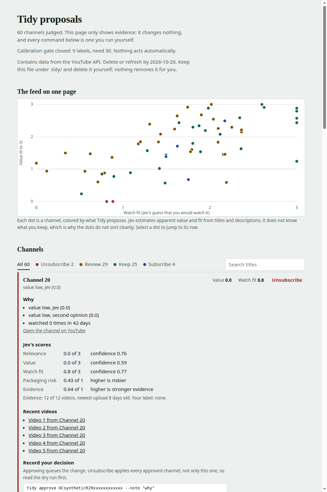

# Tidy

Keeps your YouTube subscriptions current. [Jev](https://docs.typesafe.ai) judges every channel in seconds, plain code
sets the limits, and you approve every change.


[Watch with sound (MP4)](docs/assets/tidy_demo.mp4) · [X thread](https://x.com/abhinav_bansal/status/2101526616719675793) ·
[LinkedIn post](https://www.linkedin.com/posts/erabhinavbansal_jev-judged-my-110-youtube-subscriptions-in-activity-7507286623773007873-XqIk)

## What it does

- **Prunes.** Proposes unsubscribing from channels that Jev and a second model both rate low quality.
- **Finds.** Proposes channels you watch often but do not follow, counted from your Google Takeout watch history.
- **Asks first.** Every unsubscribe is a dry run until you approve it and add `--execute`. Nothing runs on a timer.
- **Stays cheap.** About 9 seconds and a fraction of a cent for 110 channels. Changes go through the official
  YouTube API, with no browser automation.

## Quick start

You need Python 3.14, a Google Cloud project with the YouTube Data API v3 and a Desktop OAuth client, and a
[TypeSafe API key](https://console.typesafe.ai). A Google Takeout watch history (HTML) makes the proposals much better.

```bash
curl -fsSL https://raw.githubusercontent.com/abhibansal60/tidy/main/install.sh | sh
cd tidy && . .venv/bin/activate
mkdir -p .tidy secrets                      # then save your OAuth client JSON as secrets/client_secret.json
echo '{"expected_email": "you@gmail.com"}' > .tidy/config.json
echo 'TYPESAFE_API_KEY=your-key' > .env     # git-ignored
```

Or with pipx: `pipx install git+https://github.com/abhibansal60/tidy` (run it from an empty working folder, since Tidy keeps
its data in `./.tidy`). Then:

```bash
tidy auth                                   # read-only sign-in (opens a browser)
tidy sync                                   # fetch your subscriptions
tidy collect --all --max-units 400 --execute
tidy judge --schemas titles-desc-v1 --execute
tidy propose --html .tidy/proposals.html    # open it: proposals with reasons, videos and the commands to act
```

The page (synthetic example below) shows a map of the whole feed and one row per channel with Jev's scores, the reasons
and the commands to record your decision. It is read-only and holds no secrets.



To apply changes: `tidy auth --write`, `tidy approve CHANNEL_ID... --note "why"`, `tidy unsubscribe` (dry run), then
`tidy unsubscribe --execute`. To act on SUBSCRIBE proposals (channels you watch but do not follow), write them with
`tidy propose --json .tidy/proposals.json`, then `tidy act --proposals .tidy/proposals.json --gate-subscribe` is a dry run
that shows what would happen within the per-run cap of 3; `--execute` applies it once the calibration gate is open or
you pass `--override-gate`. The full setup, including the Google Cloud steps, is in
[docs/agent-setup.md](docs/agent-setup.md).

## Set it up with an agent

Paste this into Claude Code, Codex or any coding agent:

```text
Set up Tidy for me. Read docs/agent-setup.md in https://github.com/abhibansal60/tidy and follow it exactly.
Stop and ask me whenever a step needs my Google account, an API key or a browser. Never print my secrets
in chat, and never run a command with --execute until I say so.
```

## How often

About once a month, started by you. YouTube's API terms require refreshing API-derived data within 30 days, and Tidy
purges older evidence itself (`tidy purge` does it on demand). Re-export your Takeout watch history before each run. A full run for 100 channels costs
about 300 quota units of the 10,000 you get per day.

## Safety

- Private data (`.tidy/`, `data/`, `secrets/`, tokens, the database) is git-ignored and never leaves your machine, except
  channel evidence sent to Jev and the second-opinion model you choose.
- Read-only and write tokens are separate. Write access is only requested when you ask for it.
- Unsubscribes are dry-run by default, budget-checked before the first delete, logged, and automatic unsubscribes can be undone with `tidy resubscribe` (for a manual one, subscribe again on YouTube).
- Automatic actions stay off until a calibration check against your own labels passes, and even then are capped per run.
  See [ADR 0005](docs/adr/0005-gated-owner-started-autonomy.md).
- Not affiliated with YouTube, Google or TypeSafe. Use at your own risk.

## What we measured

On 110 subscriptions, Jev was 21 to 48 times faster than seven frontier models run through their coding CLIs
(3 to 6 times faster in independent direct-API tests) and far cheaper. No model, Jev included, predicted which
channels its owner keeps; the owner's watch history did better. Details and caveats are in the posts above and in
[docs/research](docs/research).

## More

[Jev playbook](docs/guide/jev-playbook.md) · [Reference](docs/reference.md) · [Agent setup](docs/agent-setup.md) · [Design](docs/design/modules.md) ·
[Decisions](docs/adr) · [Evals](evals) · [License](LICENSE) (MIT)
