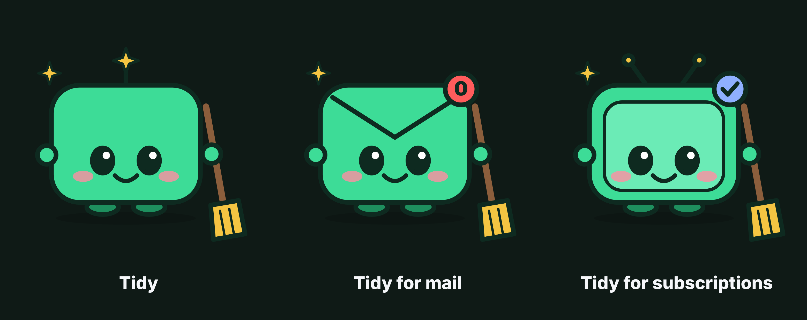

# Tidy brand kit

Tidy is one little character with a broom, and a costume for each thing it cleans up.

Free to use in posts, videos and slides about Tidy (MIT, like the code). SVGs scale to any size; PNGs are 2x.
Regenerate everything with `python docs/assets/brand/make_brand.py`.

| File | Use |
|---|---|
| `tidy-mascot` | the main character, transparent background: logo, stickers, video overlays |
| `tidy-mascot-mail` | the email costume (envelope, "0" unread badge) for mail content |
| `tidy-mascot-subscriptions` | the subscriptions costume (little TV, check badge) for YouTube content |
| `tidy-icon` | square app icon or profile picture |
| `tidy-lockup-light` / `-dark` | character plus the "tidy" wordmark, for headers and title cards |
| `tidy-launch-card` | 16:9 image for X and LinkedIn posts |
| `tidy-family` | all three together |

Colors: mint `#3DDC97`, ink `#0E2A20`, night `#0F1A16`, sparkle `#F4C542`, badge `#FF5C5C`, blush `#FF8FA3`. Font: Inter.
Costumes use generic props only: never another company's logo (for example, no play-button shapes).
