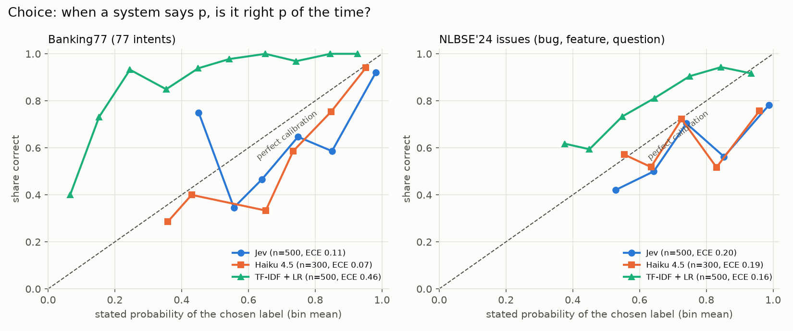
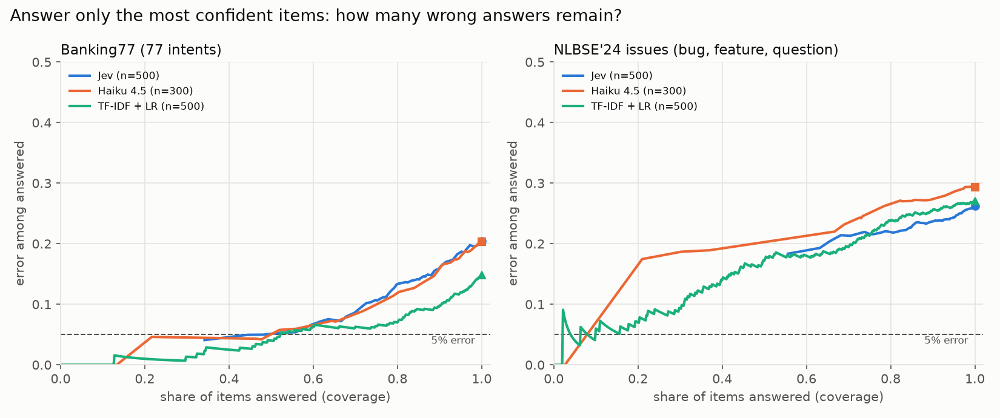
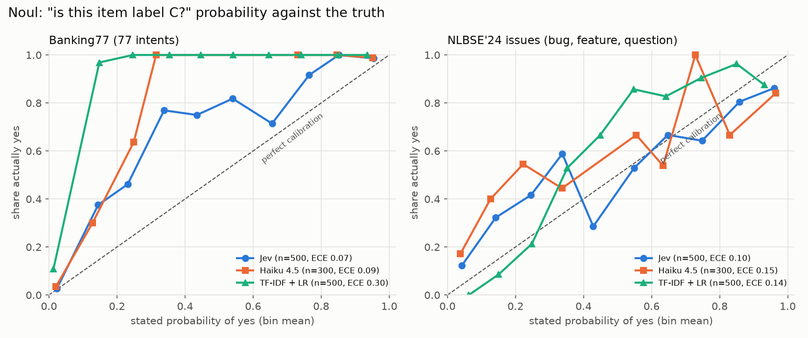

# Jev calibration audit on public labeled data

Status: complete (runs of 2026-10-05). Sections 1 to 4 were committed (5ff5a21) before any evaluation call and
are unchanged. Results, deviations and verdicts are in sections 5 to 8.

## 1. Question

TypeSafe's launch post says Jev is "Calibrated: higher confidence means higher accuracy"
([Introducing System One Models & Jev](https://typesafe.ai/blog/introducing-system-one-models-and-jev),
2026-09-15). The docs define Choice `confidence` as "a number from 0 to 1 computed from how `probabilities` is
spread" ([Choice primitive](https://docs.typesafe.ai/primitives/choice)). Our Tidy work could not test this:
its labels were one person's taste and were noisy (playbook, open questions). This audit tests it on public
tasks that have a real answer:

1. Does Jev's confidence track correctness well enough to use as an abstain gate (send low-confidence items to
   a person or a stronger model)?
2. Are Jev's Noul values calibrated probabilities on a yes/no question with known truth?
3. How does that compare with a cheap LLM (Claude Haiku 4.5) and a non-model baseline (TF-IDF plus logistic
   regression), on accuracy, repeatability, latency and cost?

The decision this informs: whether a future Tidy or work use case may route on Jev confidence without a
labeled calibration set of its own. The owner of that decision is Abhinav. A wrong "go" means silent misroutes,
so the bar is set on held-out error, not on agreement with another model.

## 2. Data (public only)

| Dataset | Task | Labels | Eval split used | Train split used (baseline only) | Licence |
| --- | --- | --- | --- | --- | --- |
| Banking77 (Casanueva et al. 2020) | 77 fine-grained banking intents from short customer messages | expert-written and labeled | 500 items sampled from the 3,080-item test set | full 10,003-item train set | CC BY 4.0 |
| NLBSE'24 issue report classification (Kallis et al.) | GitHub issue type: bug, feature or question, from 5 repos (react, tensorflow, vscode, bitcoin, opencv) | maintainers' issue labels; multi-label issues excluded by the dataset authors | 500 items sampled from the 1,500-item test set | full 1,500-item train set | public GitHub issues; the repo's licence is listed as "Other" and its LICENSE file is empty, so we download at run time and do not redistribute |

Sources: Banking77 CSVs at `github.com/PolyAI-LDN/task-specific-datasets` (the same URLs the Hugging Face
`PolyAI/banking77` loader uses); NLBSE CSVs at `github.com/nlbse2024/issue-report-classification/data`.

A US CFPB complaints set was the first choice for a support-ticket dataset, but its public API and bulk CSV no
longer include complaint narratives (checked 2026-10-05), so there is no text to classify.

Item text sent to models: Banking77 message as is; NLBSE repository name, title and the first 1,500 characters
of the body. No personal or company data is sent anywhere. Raw model outputs stay in `.tidy/calibration/`
(gitignored); only aggregates are committed.

Sampling is seeded (`random.Random(2026)`) and frozen in a manifest before any model call; every system sees
the same items and the same text.

## 3. Systems and questions

Each item gets two questions in one call:

- **Choice** over all labels (77 or 3). Measures: top label, its probability, and Jev's `confidence`.
- **Noul** "does this item belong to label C?", where C is the true label for a seeded half of the items and a
  random other label for the rest. Truth is known, so the Noul value can be scored as a probability.

| System | How it answers | Confidence signal |
| --- | --- | --- |
| Jev (`jev-latest`, typesafe-sdk) | one `system_one` call, Choice plus Noul bundled (independent questions) | Choice `confidence`, Choice top probability, Noul value |
| Claude Haiku 4.5 (`claude -p`, default effort, tools off, short system prompt, JSON schema) | one call per item, same label list and wording | verbalized probability that its label is right; verbalized P(yes) for the Noul |
| TF-IDF + logistic regression (scikit-learn defaults, word 1-2 grams, `max_iter=2000`) | trained on the train split | predicted class probability; P(C) for the Noul |

Differences named up front: the baseline is supervised on in-domain training data; Jev and Haiku are
zero-shot. Haiku sees both questions in one prompt (they can influence each other); Jev's bundled questions
cannot see each other. Haiku runs through the Claude Code CLI because no direct API key is configured, so its
wall time includes CLI start-up; we report the CLI's API time next to wall time and name which one each
multiplier uses.

Sample sizes and hard caps (enforced in code): Jev and TF-IDF on all 500 items per dataset; Haiku on the first
300 of the same frozen order (to limit subscription usage); a re-run slice of the first 100 items (Jev) and
first 50 items (Haiku), no cache, for repeatability. Hard cap: 1,000 model calls per system per dataset per
run. Expected Jev cost at $0.042 per million input tokens: well under $0.10 in total.

## 4. Analysis plan and go/no-go rule (fixed before results)

Metrics, all on the frozen items, 95% intervals by percentile bootstrap (2,000 resamples, seed 7):

- Accuracy with interval. Paired accuracy difference (Jev minus each baseline) on shared items, with interval.
- Reliability curve: 10 equal-width bins of the confidence signal; per-bin accuracy; expected calibration
  error (ECE, bin-weighted mean of |accuracy - mean confidence|). Brier score for Noul.
- Discrimination: AUROC of the confidence signal for "the top label is correct"; AUROC of Noul for truth.
- Abstain-band table: for thresholds 0.3 to 0.95, coverage (share of items answered) and error among answered.
- Held-out abstain test: split items in two halves by seeded index. On half A pick the lowest threshold whose
  error is at most 5%; apply it to half B and report coverage and error there.
- Repeatability on the re-run slice: top-label agreement and mean absolute change of the confidence signal.
- Latency per call (median, p95) and whole-run wall time, workers named. Cost: Jev at the published
  $0.042 per million input tokens (output free); Haiku as the CLI reports it and as a direct-API list-price
  estimate at $1 input and $5 output per million tokens
  ([Claude pricing](https://platform.claude.com/docs/en/about-claude/pricing), checked 2026-10-05).

**Go/no-go for "route on Jev's Choice confidence without a private calibration set"**, decided per dataset and
per signal (`confidence`, top probability); GO only if all hold:

1. Accuracy not worse than Haiku 4.5 by more than 5 points: lower bound of the paired difference interval above -5 points.
2. Confidence ranks correctness: AUROC at least 0.75 with interval lower bound above 0.65.
3. Held-out abstain gate works: the threshold picked on half A gives at most 7.5% error on half B while
   answering at least 50% of half B.
4. Repeatable: top-label agreement at least 95% and mean absolute confidence change at most 0.05 on the re-run slice.

**Noul is "calibrated enough to threshold as a probability"** if ECE is at most 0.10 and AUROC at least 0.85.

Anything else is NO-GO for that dataset and signal, and the use case needs its own labeled calibration set.
Agreement between Jev and Haiku is reported only as consistency, never as accuracy. The non-model baseline is
reported next to every Jev number; if it beats Jev, that leads the summary.

## 5. Results

**Short version.** On short bank-support messages Jev was as accurate as Claude Haiku 4.5 (79.6% against 79.7%) and its
confidence ranked its own mistakes about as well. On GitHub issue reports its confidence said little: Jev gave 99% or
more to 63% of issues and was right on 81% of those. A TF-IDF plus logistic regression model trained on each
dataset's public training split, with no LLM at all, matched or beat Jev on accuracy on both sets. The go/no-go
rule is NO-GO on both datasets; Banking77 missed only on coverage (49.6% answered against the 50% bar).

### Accuracy (95% bootstrap intervals)

| | Banking77 (77 intents) | NLBSE'24 issues (3 types) |
| --- | --- | --- |
| Jev, 500 items | 79.6% (76.0 to 83.0) | 73.8% (69.8 to 77.6) |
| Haiku 4.5, first 300 of the same items | 79.7% (75.0 to 84.3) | 70.7% (65.7 to 76.0) |
| TF-IDF + LR, 500 items, trained on the train split | **85.2%** (82.0 to 88.0) | 73.0% (69.2 to 77.0) |
| Jev minus Haiku 4.5, paired on 300 items | -1.0 points (-4.7 to +2.7) | 0.0 points (-3.3 to +3.3) |
| Jev minus TF-IDF + LR, paired on 500 items | -5.6 points (-10.0 to -1.2) | +0.8 points (-4.0 to +5.6) |

For scale: Banking77's published fine-tuned models reach about 93% on the full test set (Casanueva et al. 2020); our
items are a 500-item sample, so treat that as context, not a like-for-like comparison.

### Does confidence track correctness?

"Top probability" is the probability a system gave its chosen label (Haiku states it in words). Jev also returns
a `confidence` field; it behaved almost identically to top probability (AUROC within 0.002 on both sets).

| | Banking77 AUROC | Banking77 ECE | NLBSE AUROC | NLBSE ECE |
| --- | --- | --- | --- | --- |
| Jev top probability | 0.81 (0.76 to 0.86) | 0.11 | 0.63 (0.57 to 0.69) | 0.20 |
| Jev `confidence` | 0.81 (0.76 to 0.86) | 0.10 | 0.64 (0.58 to 0.69) | 0.19 |
| Haiku 4.5 stated probability | 0.82 (0.76 to 0.88) | 0.07 | 0.64 (0.57 to 0.70) | 0.19 |
| TF-IDF + LR probability | 0.82 (0.77 to 0.87) | 0.46 | 0.68 (0.63 to 0.73) | 0.16 |

AUROC 0.5 means confidence carries no information about being right; 1.0 means every right answer was more
confident than every wrong one. ECE is the average gap between stated probability and actual accuracy.



Bins with fewer than 5 items are not drawn. Jev and Haiku sit below the diagonal (overconfident); TF-IDF sits
above it on Banking77 (its probabilities are spread over 77 classes, so it is underconfident but ranks well).

The saturation problem: Jev returned a top probability of 0.99 or more on 44% of Banking77 items (95% of those
right) and on 63% of NLBSE items (81% of those right). Because so many items tie at the top, a threshold cannot
separate the good ones from the bad ones on NLBSE.

### Abstain bands: answer only above a threshold

Coverage is the share of items answered; error is among those answered.

| Threshold on top probability | Jev B77 | Haiku B77 | TF-IDF B77 | Jev NLBSE | Haiku NLBSE | TF-IDF NLBSE |
| --- | --- | --- | --- | --- | --- | --- |
| 0.5 | 97% / 19.7% | 95% / 17.9% | 31% / 1.3% | 100% / 26.1% | 100% / 29.4% | 59% / 17.9% |
| 0.7 | 86% / 14.6% | 89% / 14.7% | 14% / 1.4% | 92% / 23.8% | 88% / 27.2% | 21% / 7.5% |
| 0.9 | 68% / 8.0% | 56% / 6.0% | 2% / 0% | 81% / 21.8% | 73% / 24.3% | 2% / 8.3% |
| 0.95 | 60% / 6.7% | 46% / 4.3% | 1% / 0% | 74% / 22.0% | 67% / 22.0% | 1% / 0% |

TF-IDF's raw probabilities are low on a 77-way task, so the same threshold means something different per system;
compare the curves, not single rows.



Held-out gate (threshold picked on half A for at most 5% error, applied to half B):

| | Threshold | Half B answered | Half B error |
| --- | --- | --- | --- |
| Jev `confidence`, Banking77 | 0.97 | 49.6% | 4.8% |
| Jev top probability, Banking77 | 0.98 | 47.6% | 5.0% |
| Haiku 4.5, Banking77 | 0.97 | 12.0% | 0.0% |
| TF-IDF + LR, Banking77 | 0.37 | 47.6% | 2.5% |
| Jev (both signals), NLBSE | none reaches 5% on half A | 0% | n/a |
| Haiku 4.5, NLBSE | 0.99 | 2.7% | 0.0% |
| TF-IDF + LR, NLBSE | 0.72 | 18.0% | 11.1% |

### Noul: a yes/no probability against the truth

Each item also asked "does this item belong to label C?", with C the true label for about half the items.

| | Banking77 ECE | Banking77 AUROC | NLBSE ECE | NLBSE AUROC |
| --- | --- | --- | --- | --- |
| Jev | 0.07 | 0.98 | 0.10 (0.0998) | 0.86 |
| Haiku 4.5 | 0.09 | 0.99 | 0.15 | 0.84 |
| TF-IDF + LR | 0.30 | 1.00 | 0.14 | 0.87 |



Jev's Noul was the best-calibrated yes/no probability of the three on both sets. On Banking77 it is too cautious
in the middle (items it gives 0.3 to 0.7 are yes about 75% of the time).

### Repeatability (same items, second uncached run)

| | Same label | Mean change in top probability |
| --- | --- | --- |
| Jev, Banking77, 100 items | 98% | 0.017 |
| Jev, NLBSE, 100 items | 97% | 0.008 |
| Haiku 4.5, Banking77, 50 items | 90% | 0.058 |
| Haiku 4.5, NLBSE, 50 items | 98% | 0.033 |

TF-IDF + LR is deterministic.

### Speed and cost

| | Per-call median (p95) | Whole run | Cost, as run | Cost per 1,000 items |
| --- | --- | --- | --- | --- |
| Jev, Banking77 | 374 ms (481) | 500 items in 36 s, 6 workers | $0.022 (526,013 input tokens) | $0.044 |
| Jev, NLBSE | 379 ms (522) | 500 items in 37 s, 6 workers | $0.016 (373,790 input tokens) | $0.031 |
| Haiku 4.5, Banking77 | API time 7.4 s; CLI wall 8.7 s (19.7 s) | see deviations | CLI-reported $3.66; direct-API estimate $1.44 | about $4.79 (estimate) |
| Haiku 4.5, NLBSE | API time 8.8 s; CLI wall 10.1 s (20.3 s) | see deviations | CLI-reported $3.57; direct-API estimate $1.49 | about $4.98 (estimate) |
| TF-IDF + LR | under 2 ms per item | training plus 500 items in 7 to 15 s on a laptop CPU | $0 | $0 |

Jev's median call was about 20 times faster than Haiku 4.5's API time (7.4 s against 374 ms on Banking77; baseline:
Haiku 4.5 through the Claude Code CLI at default effort, which thinks before answering, about 800 output tokens
per item). A direct API call with thinking off would be faster and cheaper; we did not measure that. Jev prices:
$0.042 per million input tokens, output free (TypeSafe launch post). Haiku 4.5: $1 input and $5 output per million
tokens (Claude pricing page, checked 2026-10-05); the estimate counts prompt characters / 3.5 as input tokens and
the measured output tokens. The CLI-reported figure includes Claude Code's own prompt overhead. Total spend for
the audit: Jev about $0.045; Haiku about $8.50 CLI-reported, billed against a Claude subscription.

## 6. Go/no-go verdicts (rule from section 4)

| Criterion | Banking77, `confidence` | Banking77, top probability | NLBSE, either signal |
| --- | --- | --- | --- |
| 1. Not worse than Haiku by more than 5 points | pass (lower bound -4.7) | pass | pass (lower bound -3.3) |
| 2. AUROC at least 0.75, lower bound above 0.65 | pass (0.81, 0.76) | pass (0.81, 0.76) | **fail** (0.63 to 0.64) |
| 3. Held-out gate: at most 7.5% error, at least 50% answered | **fail, narrowly** (4.8% error, 49.6% answered) | **fail, narrowly** (5.0%, 47.6%) | **fail** (no threshold) |
| 4. Repeatable (at least 95% same label, change at most 0.05) | pass (98%, 0.017) | pass | pass (97%, 0.008) |
| **Verdict** | **NO-GO** | **NO-GO** | **NO-GO** |

Noul "calibrated enough to threshold as a probability" (ECE at most 0.10, AUROC at least 0.85): **pass** on
Banking77 (0.07, 0.98) and **pass at the edge** on NLBSE (0.0998, 0.86).

What this means for routing: Jev's confidence is not a substitute for your own labeled calibration set. On a
task that resembles Banking77 a 0.97 threshold came close to the bar; on issue triage it did not work at all. A
use case still needs a few hundred of its own labels to pick and check a threshold, which is the playbook rule.

## 7. Deviations from the plan

- **Haiku retries.** The plan did not say what to do with failed calls. 213 of 300 Banking77 Haiku calls first
  returned no structured answer (reason not recorded in that first pass), and later 188 NLBSE calls and both
  repeat slices failed because the Claude subscription session limit was reached. The runner now records the
  reason and cost of each failed call, and `--retry-errors` re-asked only the items with no answer; answered items
  were never re-asked. The cost of the first 213 failed Banking77 calls was not recorded, so Haiku's CLI-reported
  cost is an undercount.
- **Haiku concurrency.** First pass ran with 6 workers, retries with 3. Per-call latency is reported, not wall time.
- **Haiku effort.** Default effort (thinking on); the plan said "default effort", but it is worth naming because it
  drives Haiku's latency and output cost.
- **Dataset swap.** CFPB complaints were dropped before any model call (narratives no longer published); NLBSE'24
  issues were used instead (section 2).

## 8. Limits of this evidence

- Two public English datasets, 500 items each (300 for Haiku). Intervals are wide: about plus or minus 4 points on
  accuracy.
- One cheap LLM baseline through a CLI, at one effort level. Larger models or few-shot prompts would likely do better.
- The non-model baseline uses in-domain training labels; Jev and Haiku do not. That is the point of the comparison
  (what you get when you do have labels), not a like-for-like model contest.
- NLBSE labels come from maintainers and are noisy (an issue labeled "question" can read like a bug report); no
  model can reach 100% on it. We did not measure that noise.
- Jev `jev-1.13.0` (returned by the API on 2026-10-05); results may change with model versions.

## How to reproduce

```bash
python -m venv .venv && .venv/bin/pip install -e . scikit-learn matplotlib
.venv/bin/python -m evals.calibration_audit fetch                       # public data, frozen manifests
TIDY_DATA_DIR=~/.tidy .venv/bin/python -m evals.calibration_audit run --system jev --dataset banking77
.venv/bin/python -m evals.calibration_audit run --system tfidf --dataset banking77
.venv/bin/python -m evals.calibration_audit run --system haiku --dataset banking77 --limit 300   # uses Claude plan limits
.venv/bin/python -m evals.calibration_audit run --system jev --dataset banking77 --limit 100 --repeat
.venv/bin/python -m evals.calibration_audit report && .venv/bin/python -m evals.calibration_charts
```

Repeat with `--dataset nlbse`. Tests: `python -m unittest discover -s tests`.

## Progress checklist

- [x] Plan, go/no-go rule and analysis plan committed before any evaluation call
- [x] Data fetch and frozen manifests
- [x] Metrics module with tests (`evals/calibration.py`)
- [x] TF-IDF baseline run
- [x] Jev run, both datasets, plus re-run slice
- [x] Haiku run, both datasets, plus re-run slice (with retries, section 7)
- [x] Report numbers, charts, go/no-go verdicts
- [x] Draft post summary (unposted, below)
- [x] PR opened and linked (#12)

## Draft post (not posted; for the owner to edit)

Plain-language version, for people who have never heard of Jev:

> Jev is a small AI from TypeSafe that sorts things (emails, support messages, tickets) and also says how sure it
> is. Its makers say: when Jev is confident, it is right. I tested that on 1,000 public examples where the right
> answer is already known.
>
> Bank customer messages: Jev was right 80% of the time, the same as Claude Haiku, about 20 times faster and
> about 100 times cheaper. When it was very sure, it was usually right.
>
> GitHub bug reports: Jev said "99% sure" on almost two thirds of them and was right on only 81% of those. Being
> sure did not mean being right.
>
> The surprise: a simple word-counting model with no AI at all, trained on public examples, did as well or better
> on both.
>
> Lesson: Jev is fast, cheap and steady, but check its confidence on your own examples before you let it act alone.
